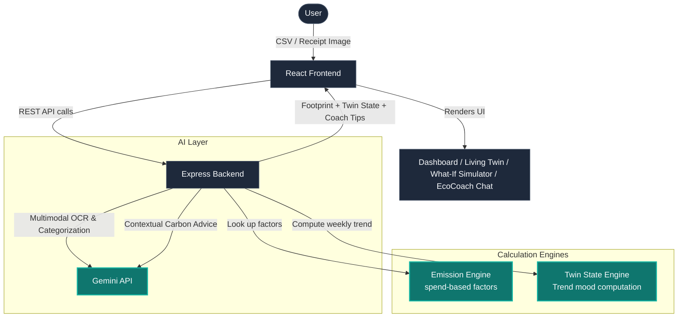

# EcoTwin — "Your Carbon Footprint, Visualized as a Living Thing"

Most footprint trackers fail for one simple reason: **manual logging is friction**, and nobody keeps doing it past day 3. EcoTwin removes this friction completely by replacing guilt-based dashboards with an emotional, shareable visual representation of your footprint.

> [!NOTE]
> Instead of asking users to log every action, EcoTwin ingests what they already have — a bank/credit-card statement (CSV) or a receipt photo — and uses the **Gemini API** (`gemini-3.5-flash`) to handle categorization and OCR in a single call. **No manual entry required.**

---

## 🌟 Core Highlights (Judges' Favorites)

1. **Spend-Based Carbon Estimation**
   Every dollar spent in a category (fuel, flights, groceries, fast fashion, etc.) maps to an average `kgCO2e/$` emission factor. This is a real methodology used by fintech carbon tools (Connect Earth, Aspiration, Tred). **Gemini API** classifies the transaction details, and our engine does the math.
   
2. **The "Twin" Organism**
   A single visual organism (🌱 sapling → 🌳 thriving forest → 🥀 wilting → 🏜️ drought) whose state changes dynamically based on your **emissions trend**, not absolute numbers. It is the demo's wow-moment and a direct callback to nature.
   
3. **What-If Simulator**
   Interactive sliders ("drive 2 fewer days/week", "cut red meat 50%") instantly recompute your projected footprint and translate it into visceral equivalents ("= planting 4 trees/year"). Built entirely with fast, client-side math to ensure a flawless live demo.
   
4. **EcoCoach AI Chatbot**
   A conversational assistant powered by `gemini-3.5-flash` that analyzes your actual transaction history to give personalized, actionable advice (e.g., *"You spent $91 at Shell twice this week — try taking the commuter train on Tuesdays"*).

---

## 🏗️ System Architecture



---

## 🛠️ Technology Stack

| Layer | Choice | Why |
| :--- | :--- | :--- |
| **Frontend** | React + Vite + TailwindCSS + Recharts | Fast scaffolding, high-fidelity UI components, and judges respond well to polished dashboards. |
| **Backend** | Express (Node.js) + TypeScript | Lightweight API server, shared language stack, and extremely fast startup time. |
| **AI** | Gemini API (`gemini-3.5-flash`) | Multimodal vision & text capability. A single model does OCR, categorization, and coaching with structured JSON responses. |
| **Deploy** | Vercel (Frontend) + Render / Railway (Backend) | Direct integration with Git for one-click deployments. |
| **CI** | GitHub Actions | Builds and lints on Pull Requests to maintain an industry-grade codebase. |

---

## 🚀 Running Locally

### Prerequisites
* **Node.js** (v18 or higher recommended)
* A **Gemini API Key** (Get one from [Google AI Studio](https://aistudio.google.com/))

### 1. Install Dependencies
```bash
npm install
```

### 2. Configure Environment
Create a `.env.local` file in the root directory:
```env
# Your Gemini API Key from AI Studio
GEMINI_API_KEY="YOUR_GEMINI_API_KEY"

# The port Express will listen on
PORT=3001
APP_URL="http://localhost:3001"
```

### 3. Launch Development Server
```bash
npm run dev
```
Open **[http://localhost:3001](http://localhost:3001)** in your browser.
