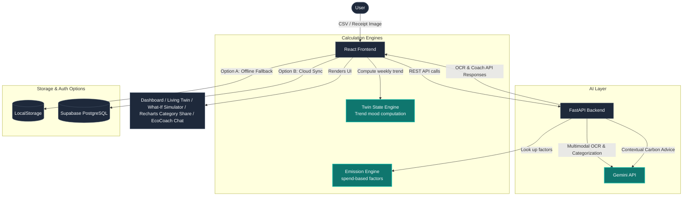

# EcoTwin — "Your Carbon Footprint, Visualized as a Living Thing"

Most footprint trackers fail for one simple reason: **manual logging is friction**, and nobody keeps doing it past day 3. EcoTwin removes this friction completely by replacing guilt-based dashboards with an emotional, shareable visual representation of your footprint.

> [!NOTE]
> Instead of asking users to log every action, EcoTwin ingests what they already have — a bank/credit-card statement (CSV) or a receipt photo — and uses the **Gemini API** (`gemini-3.5-flash`) via a **FastAPI (Python)** backend to handle categorization and OCR in a single call. **No manual entry required.**

---

## 🌟 Core Highlights (Judges' Favorites)

1. **Spend-Based Carbon Estimation**
   Every dollar spent in a category (fuel, flights, groceries, fast fashion, etc.) maps to an average `kgCO2e/$` emission factor. This is a real methodology used by fintech carbon tools (Connect Earth, Aspiration, Tred). **Gemini API** classifies the transaction details, and our backend does the math.
   
2. **The "Twin" Organism**
   A single visual organism (🌱 sapling → 🌳 thriving forest → 🥀 wilting → 🏜️ drought) whose state changes dynamically based on your **emissions trend**, not absolute numbers. It is the demo's wow-moment and a direct callback to nature.
   
3. **What-If Simulator**
   Interactive sliders ("drive 2 fewer days/week", "cut red meat 50%") instantly recompute your projected footprint and translate it into visceral equivalents ("= planting 4 trees/year"). Built entirely with fast, client-side math to ensure a flawless live demo.
   
4. **EcoCoach AI Chatbot**
   A conversational assistant powered by `gemini-3.5-flash` that analyzes your actual transaction history to give personalized, actionable advice (e.g., *"You spent $91 at Shell twice this week — try taking the commuter train on Tuesdays"*).

---

## 🏗️ System Architecture



---

## 🛠️ Technology Stack

| Layer | Choice | Why |
| :--- | :--- | :--- |
| **Frontend** | React + Vite + TailwindCSS + Recharts | Fast scaffolding, high-fidelity UI components, animated data charts, and clean responsive dashboards. |
| **Backend** | FastAPI (Python) | High-performance asynchronous API server, automated OpenAPI documentation generation, and native Python ecosystem integration. |
| **AI** | Gemini API (`gemini-3.5-flash`) | Multimodal vision & text capability. A single model does OCR, categorization, and coaching with structured Pydantic JSON responses. |
| **DB & Auth** | Supabase (Postgres + Magic-Link) | Client-side user auth and PostgreSQL persistence with dynamic guest-mode fallback to `localStorage`. |
| **Deploy** | Vercel (Frontend) + Render / Railway (Backend) | Direct integration with Git for one-click deployments. |
| **CI** | GitHub Actions | Builds and lints on Pull Requests to maintain an industry-grade codebase. |

---

## ⚡ Zero-Config Guest Fallback (Option A)

By default, if the Supabase environment variables are left blank, **EcoTwin automatically runs in Local Storage Guest Mode**. 
* Transactions are persisted in your local browser cache (`localStorage`).
* Preset seeding, manual entries, CSV statement imports, receipt OCR (via FastAPI), and the chatbot all function perfectly.
* **No external database signup or config is required to test!**

---

## 🚀 Running Locally

### Prerequisites
* **Node.js** (v18 or higher)
* **Python** (v3.10 or higher)
* A **Gemini API Key** (Get one from [Google AI Studio](https://aistudio.google.com/))

### 1. Configure Environment
Create a `.env.local` file in the root directory:
```env
# Your Gemini API Key from AI Studio (Required for backend AI features)
GEMINI_API_KEY="YOUR_GEMINI_API_KEY"

# Backend FastAPI Port (Standard)
PORT=8000
APP_URL="http://localhost:8000"

# Supabase Keys (Used by React Frontend - client side)
# Leave blank/placeholder to run in Guest/Local Storage fallback mode!
VITE_SUPABASE_URL=""
VITE_SUPABASE_ANON_KEY=""
```

### 2. Run the FastAPI Backend (Python)
Navigate to the root directory and install dependencies:
```bash
pip install -r backend/requirements.txt
```
Start the backend server:
```bash
python backend/main.py
```
The backend API documentation will be available at **[http://localhost:8000/docs](http://localhost:8000/docs)**.

### 3. Run the React Frontend (Vite)
Open a new terminal window in the root directory and install dependencies:
```bash
npm install
```
Start the frontend development server:
```bash
npm run dev
```
Open **[http://localhost:5173](http://localhost:5173)** in your browser. All API requests pointing to `/api` will be transparently proxied to the Python server.

---

## ☁️ Connecting Supabase (Option B - Optional)

If you are ready to enable cloud database sync and magic-link authentication:

1. Sign up on [Supabase](https://supabase.com) and create a free project named `EcoTwin`.
2. Retrieve your **Project URL** and **`anon` public key** from Settings -> API and set them in `.env.local`:
   ```env
   VITE_SUPABASE_URL="https://your-project.supabase.co"
   VITE_SUPABASE_ANON_KEY="your-anon-public-key"
   ```
3. Go to the **SQL Editor** tab in your Supabase dashboard and run the following script:
   ```sql
   create table public.transactions (
     id uuid default gen_random_uuid() primary key,
     user_id uuid references auth.users not null,
     date date not null,
     merchant text not null,
     amount numeric not null,
     category text not null,
     co2e numeric not null,
     source text not null,
     confidence numeric not null,
     created_at timestamptz default now()
   );

   -- Enable RLS
   alter table public.transactions enable row level security;

   -- Policies
   create policy "Users can modify their own transactions" 
     on public.transactions 
     for all 
     using (auth.uid() = user_id) 
     with check (auth.uid() = user_id);
   ```
4. Restart your frontend server (`npm run dev`). The app will display a `Supabase Active` badge and render the magic-link login screen!
