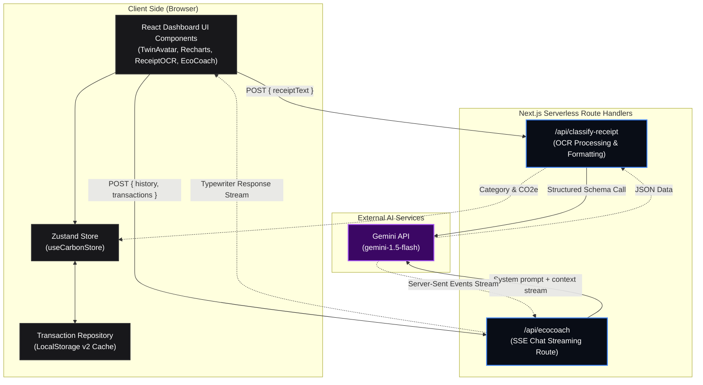
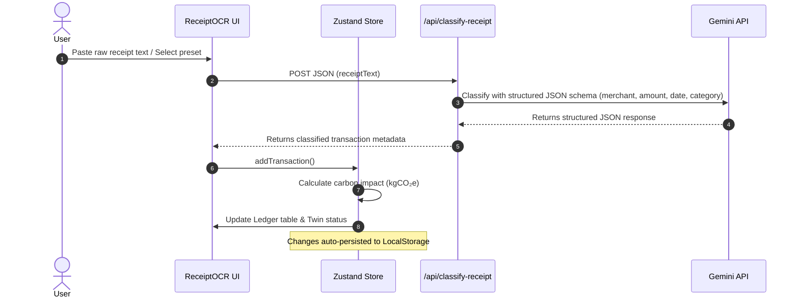
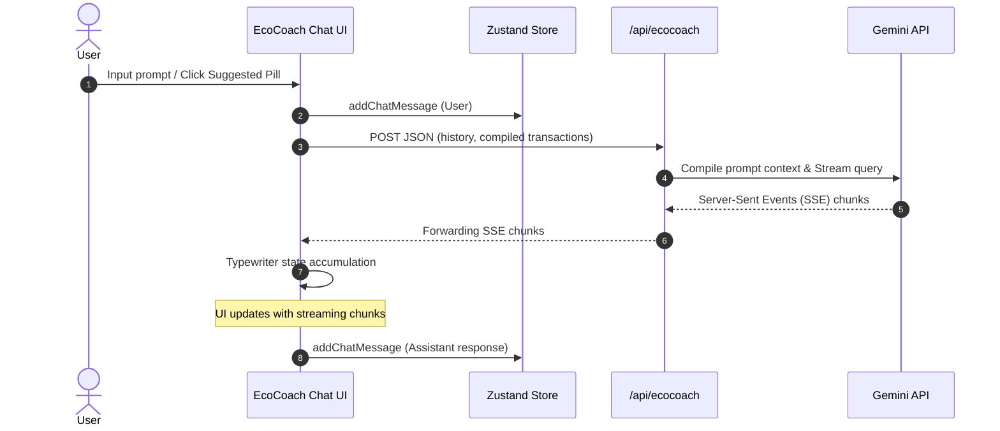

# 🌿 EcoTwin: Interactive AI Carbon Sandbox

EcoTwin is a Next.js 14 Web Application that acts as a real-time carbon sandbox. It allows users to visualize, simulate, and optimize their carbon footprint through a digital twin ecosystem. The app features client-side state persistence, visceral simulation tools, automated Gemini OCR receipt classification, and a live streaming AI EcoCoach.

---

## 🏗️ System Architecture

EcoTwin is built as a consolidated Next.js 14 Monorepo architecture, eliminating the need for a separate backend server. All backend operations are handled securely through serverless Next.js Route Handlers.



---

## 🔄 Application Workflows

### 1. Receipt OCR & Log Flow


### 2. EcoCoach Streaming Chat Flow


---

## 🚀 Key Features

* **Digital Twin Visualization (`TwinAvatar`)**: A dynamic SVG tree avatar visualizing carbon vitality (Sapling, Thriving, Wilting, Drought states) with breathing speed and glowing particle micro-animations driven by your real-time carbon score.
* **Instant Seeding (`PresetSelector`)**: Seed and customize transactions instantly using demographic profiles (e.g., Urban Minimalist, Suburban Commuter, High Carbon Lifestyle).
* **Gemini OCR Parsing**: Paste unstructured receipt strings or invoices to classify category types and calculate estimated emissions.
* **What-If Sandbox Simulation**: Interactive sliders to simulate green habit switches (meat reduction, thrifting, drive-free days) and project emissions savings in real-time.
* **EcoCoach Streaming Chat**: Chatbot persona that analyzes transaction lists and provides funny, personalized carbon mitigation suggestions.

---

## 🛠️ Prerequisites

Ensure you have the following installed on your machine:
* **Node.js**: `v20.x` or higher
* **npm**: `v10.x` or higher
* **Git**
* **Gemini API Key**: Retrieve a free key from the [Google AI Studio](https://aistudio.google.com/).

---

## ⚙️ Local Development Setup

1. **Clone the Repository**:
   ```bash
   git clone https://github.com/Debddj/EcoTwin.git
   cd EcoTwin
   ```

2. **Install Dependencies**:
   ```bash
   npm install
   ```

3. **Configure Environment Variables**:
   Create a `.env.local` file in the root directory:
   ```env
   GEMINI_API_KEY=your_gemini_api_key_here
   ```

4. **Run the Development Server**:
   Run Next.js on port `3001` (to prevent standard port conflicts):
   ```bash
   npm run dev -- -p 3001
   ```

5. **Open the App**:
   Navigate to [http://localhost:3001](http://localhost:3001) in your browser.

---

## ⚡ Deploying to Vercel (For Free)

Next.js is designed by Vercel, making it the simplest platform for free deployment.

### Step 1: Push Your Code to GitHub
Ensure all your local changes are pushed to your GitHub repository:
```bash
git add .
git commit -m "feat: setup project structure and components"
git push origin main
```

### Step 2: Connect to Vercel
1. Go to [Vercel](https://vercel.com/) and sign up / log in using your GitHub account.
2. Click the **"Add New"** button on your dashboard and select **"Project"**.
3. Import your `EcoTwin` repository from the list of repositories.

### Step 3: Configure Environment Variables
1. Under **Build & Development Settings**, keep all defaults (`Next.js` preset will automatically configure build commands).
2. Expand the **Environment Variables** section.
3. Add the following key-value pair:
   * **Key**: `GEMINI_API_KEY`
   * **Value**: `[Your Gemini API Key]` (e.g. `AIzaSy...`)

### Step 4: Deploy
1. Click **"Deploy"**.
2. Vercel will clone, build, and deploy your site in under a minute.
3. Once completed, Vercel will provide you with a production-ready `https://[your-project-name].vercel.app` domain.

---

## 🔒 Security & Offline Mode

* **Zero-Config Offline Mode**: All transactions, mock profiles, and simulation states run in the browser using the `ecotwin:transactions:v2` namespace. No database credentials are required.
* **Serverless API Protection**: Next.js route handlers hide the `GEMINI_API_KEY` on the server-side, protecting it from being leaked to client browsers.
* **Security Headers**: Custom security headers (e.g. `X-Frame-Options: DENY`, `X-Content-Type-Options: nosniff`) are configured in `next.config.mjs` to mitigate scripting attacks.

---

## 🧪 CI/CD Quality Control

A GitHub Actions workflow is active under `.github/workflows/ci.yml`. On every Pull Request or push, it automatically:
1. Validates strict TypeScript compilation without type-stripping errors (`npx tsc --noEmit`).
2. Scans for syntax violations and unused variables using ESLint (`npm run lint`).
3. Verifies production bundle generation (`npm run build`).
